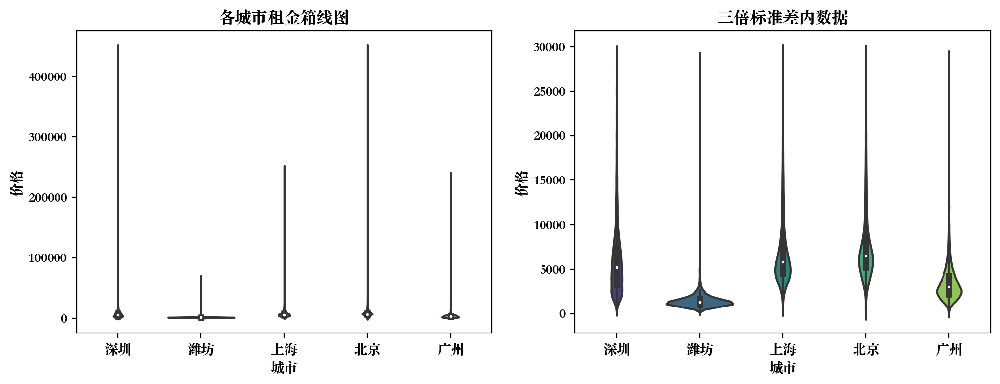
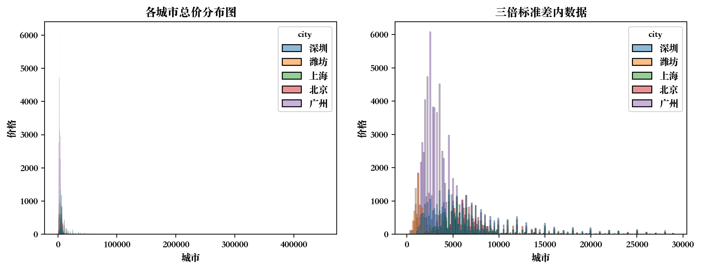
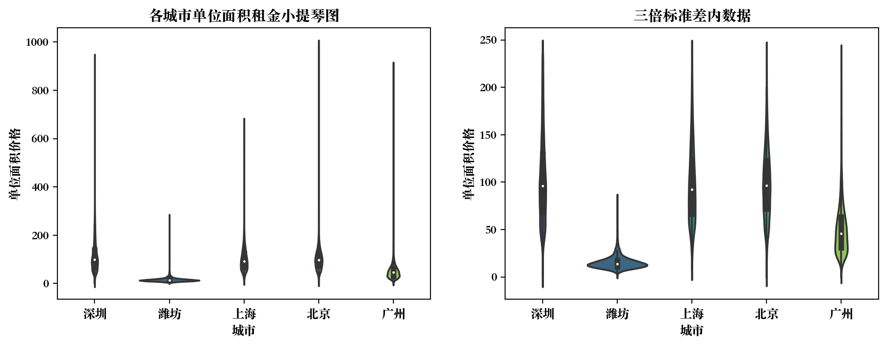
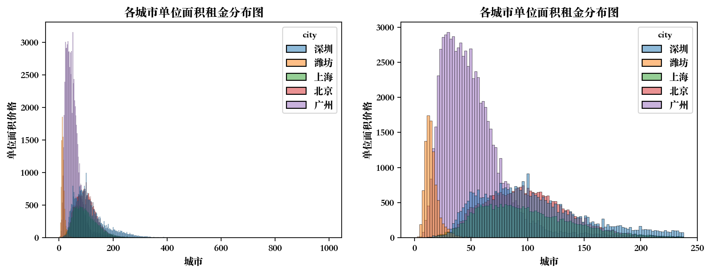
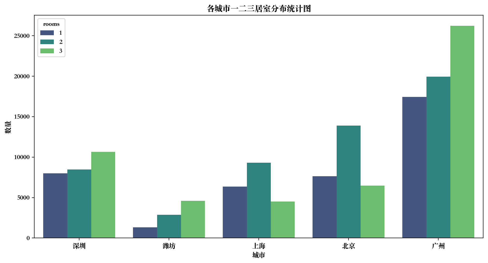
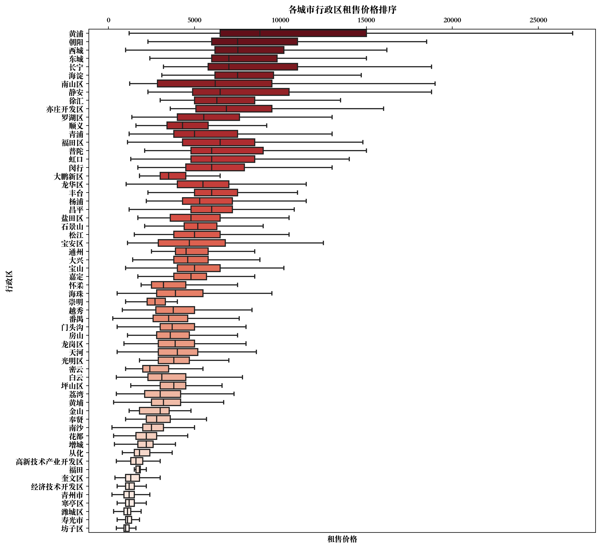
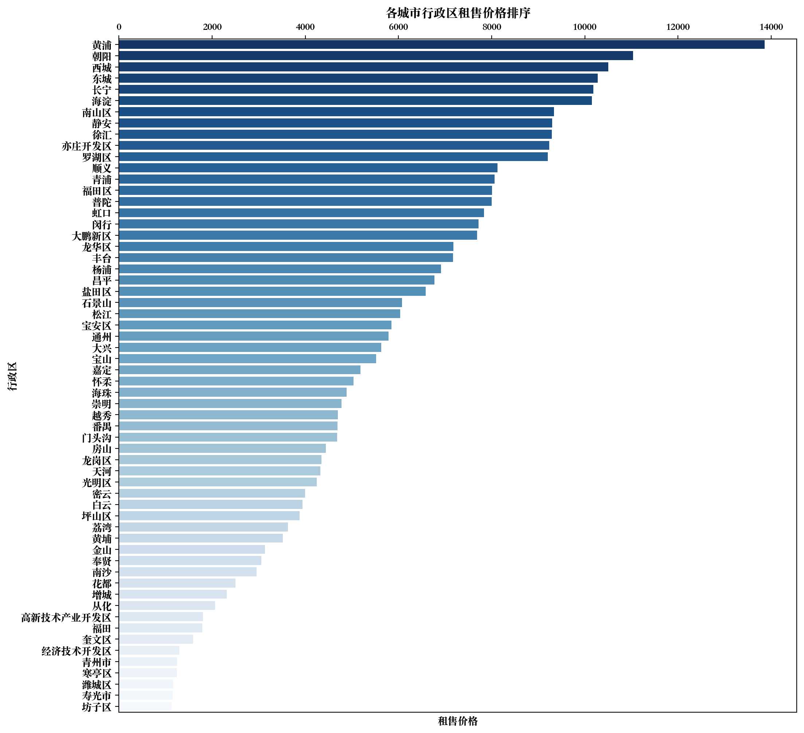
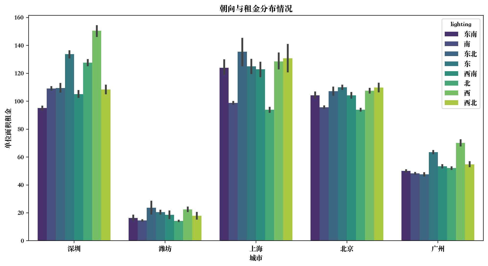
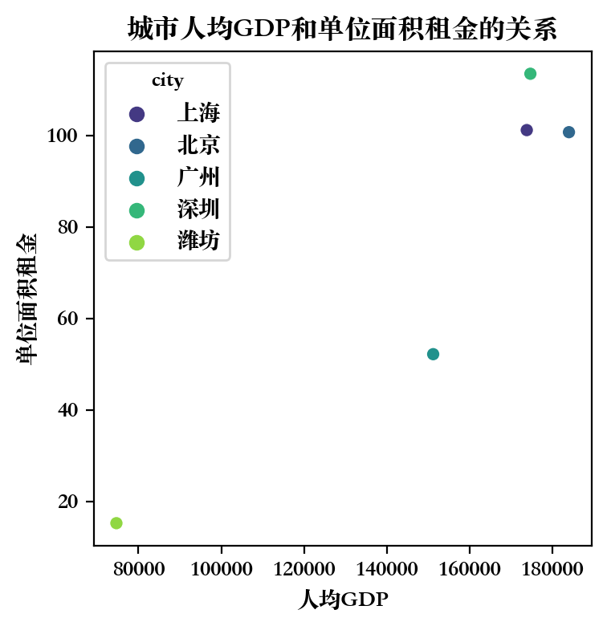
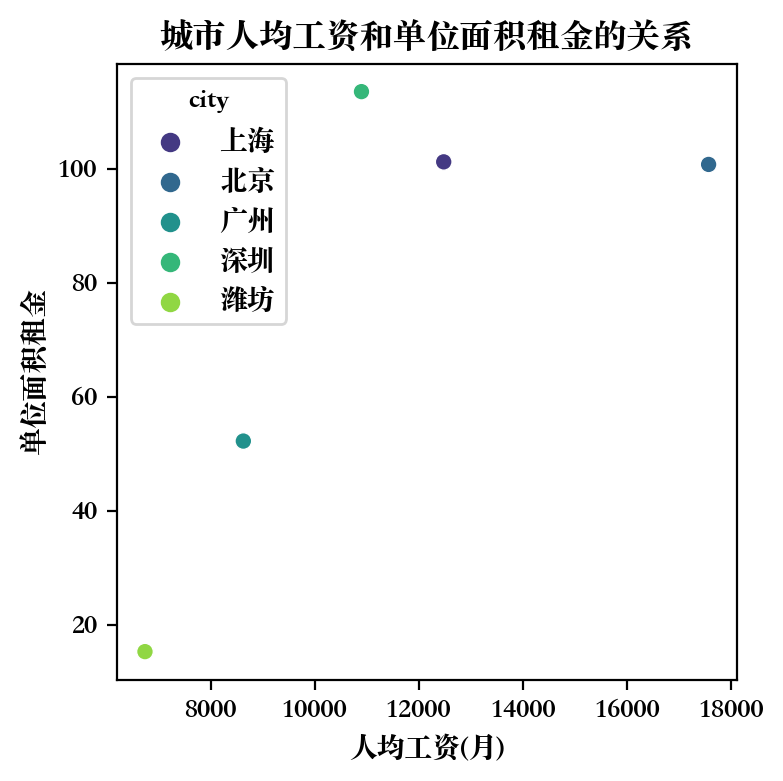

# 链家租房数据分析

## 数据导入和预处理

### 数据导入

#### 配置数据分析工具

导入numpy, pandas和matplotlib, 配置字体, 行内显示matplotlib图.


```python
import numpy as n
import seaborn as sns
import pandas as pd
from pandas import Series, DataFrame
import matplotlib.pyplot as plt
sns.set_style({'font.sans-serif': ['simhei', 'Arial']})

%matplotlib inline

# Ignore warnings
import warnings
warnings.filterwarnings('ignore')

# Config global font
plt.rcParams['font.sans-serif']='Songti SC'
plt.rcParams['axes.unicode_minus'] =False
```

#### 导入链家租房数据.


```python
lianjia_data = pd.read_csv("./database/rental.csv")
display(lianjia_data.head(), lianjia_data.shape)

```


<div>
<style scoped>
    .dataframe tbody tr th:only-of-type {
        vertical-align: middle;
    }

    .dataframe tbody tr th {
        vertical-align: top;
    }

    .dataframe thead th {
        text-align: right;
    }
</style>
<table border="1" class="dataframe">
  <thead>
    <tr style="text-align: right;">
      <th></th>
      <th>rental_id</th>
      <th>rental_name</th>
      <th>rental_url</th>
      <th>rental_city</th>
      <th>rental_region</th>
      <th>rental_business_area</th>
      <th>rental_community_url</th>
      <th>rental_community</th>
      <th>rental_area</th>
      <th>rental_lighting</th>
      <th>rental_rooms</th>
      <th>rental_liverooms</th>
      <th>rental_bathrooms</th>
      <th>rental_price</th>
      <th>rental_timestamp</th>
      <th>rental_accessbit</th>
    </tr>
  </thead>
  <tbody>
    <tr>
      <th>0</th>
      <td>1</td>
      <td>整租·海语山林 2室2厅 东南</td>
      <td>https://sz.lianjia.com/zufang/SZ17043626101466...</td>
      <td>深圳</td>
      <td>大鹏新区</td>
      <td>大鹏半岛</td>
      <td>https://sz.lianjia.com/zufang/c2411062673763/</td>
      <td>海语山林</td>
      <td>69.00</td>
      <td>东南</td>
      <td>2</td>
      <td>2</td>
      <td>1</td>
      <td>3000</td>
      <td>2022-12-26</td>
      <td>0</td>
    </tr>
    <tr>
      <th>1</th>
      <td>2</td>
      <td>整租·海语山林 2室2厅 南</td>
      <td>https://sz.lianjia.com/zufang/SZ17123504436207...</td>
      <td>深圳</td>
      <td>大鹏新区</td>
      <td>大鹏半岛</td>
      <td>https://sz.lianjia.com/zufang/c2411062673763/</td>
      <td>海语山林</td>
      <td>67.40</td>
      <td>南</td>
      <td>2</td>
      <td>2</td>
      <td>1</td>
      <td>2700</td>
      <td>2022-12-26</td>
      <td>0</td>
    </tr>
    <tr>
      <th>2</th>
      <td>3</td>
      <td>整租·海语山林 3室2厅 跃层 南</td>
      <td>https://sz.lianjia.com/zufang/SZ16540747918601...</td>
      <td>深圳</td>
      <td>大鹏新区</td>
      <td>大鹏半岛</td>
      <td>https://sz.lianjia.com/zufang/c2411062673763/</td>
      <td>海语山林</td>
      <td>79.00</td>
      <td>南</td>
      <td>3</td>
      <td>2</td>
      <td>2</td>
      <td>3300</td>
      <td>2022-12-26</td>
      <td>0</td>
    </tr>
    <tr>
      <th>3</th>
      <td>4</td>
      <td>整租·海语山林 3室2厅 南</td>
      <td>https://sz.lianjia.com/zufang/SZ17028886905623...</td>
      <td>深圳</td>
      <td>大鹏新区</td>
      <td>大鹏半岛</td>
      <td>https://sz.lianjia.com/zufang/c2411062673763/</td>
      <td>海语山林</td>
      <td>89.00</td>
      <td>南</td>
      <td>3</td>
      <td>2</td>
      <td>2</td>
      <td>3300</td>
      <td>2022-12-26</td>
      <td>0</td>
    </tr>
    <tr>
      <th>4</th>
      <td>5</td>
      <td>整租·海语山林 3室2厅 东南</td>
      <td>https://sz.lianjia.com/zufang/SZ15809179083834...</td>
      <td>深圳</td>
      <td>大鹏新区</td>
      <td>大鹏半岛</td>
      <td>https://sz.lianjia.com/zufang/c2411062673763/</td>
      <td>海语山林</td>
      <td>87.16</td>
      <td>东南</td>
      <td>3</td>
      <td>2</td>
      <td>2</td>
      <td>3500</td>
      <td>2022-12-26</td>
      <td>0</td>
    </tr>
  </tbody>
</table>
</div>


    (170039, 16)


#### 查看数据概况


```python
display(lianjia_data.info(), lianjia_data.describe())

```

    <class 'pandas.core.frame.DataFrame'>
    RangeIndex: 170039 entries, 0 to 170038
    Data columns (total 16 columns):
     #   Column                Non-Null Count   Dtype  
    ---  ------                --------------   -----  
     0   rental_id             170039 non-null  int64  
     1   rental_name           170039 non-null  object 
     2   rental_url            170039 non-null  object 
     3   rental_city           170039 non-null  object 
     4   rental_region         170039 non-null  object 
     5   rental_business_area  170039 non-null  object 
     6   rental_community_url  170039 non-null  object 
     7   rental_community      170039 non-null  object 
     8   rental_area           170039 non-null  float64
     9   rental_lighting       170039 non-null  object 
     10  rental_rooms          170039 non-null  int64  
     11  rental_liverooms      170039 non-null  int64  
     12  rental_bathrooms      170039 non-null  int64  
     13  rental_price          170039 non-null  int64  
     14  rental_timestamp      170039 non-null  object 
     15  rental_accessbit      170039 non-null  int64  
    dtypes: float64(1), int64(6), object(9)
    memory usage: 20.8+ MB


    None


<div>
<style scoped>
    .dataframe tbody tr th:only-of-type {
        vertical-align: middle;
    }

    .dataframe tbody tr th {
        vertical-align: top;
    }

    .dataframe thead th {
        text-align: right;
    }
</style>
<table border="1" class="dataframe">
  <thead>
    <tr style="text-align: right;">
      <th></th>
      <th>rental_id</th>
      <th>rental_area</th>
      <th>rental_rooms</th>
      <th>rental_liverooms</th>
      <th>rental_bathrooms</th>
      <th>rental_price</th>
      <th>rental_accessbit</th>
    </tr>
  </thead>
  <tbody>
    <tr>
      <th>count</th>
      <td>170039.000000</td>
      <td>170039.000000</td>
      <td>170039.000000</td>
      <td>170039.000000</td>
      <td>170039.000000</td>
      <td>170039.000000</td>
      <td>170039.0</td>
    </tr>
    <tr>
      <th>mean</th>
      <td>85020.000000</td>
      <td>83.868990</td>
      <td>2.366404</td>
      <td>1.300478</td>
      <td>1.303054</td>
      <td>5856.955634</td>
      <td>0.0</td>
    </tr>
    <tr>
      <th>std</th>
      <td>49086.175549</td>
      <td>541.967185</td>
      <td>1.084734</td>
      <td>0.640657</td>
      <td>0.611181</td>
      <td>7730.758572</td>
      <td>0.0</td>
    </tr>
    <tr>
      <th>min</th>
      <td>1.000000</td>
      <td>3.000000</td>
      <td>0.000000</td>
      <td>0.000000</td>
      <td>0.000000</td>
      <td>150.000000</td>
      <td>0.0</td>
    </tr>
    <tr>
      <th>25%</th>
      <td>42510.500000</td>
      <td>50.000000</td>
      <td>2.000000</td>
      <td>1.000000</td>
      <td>1.000000</td>
      <td>2500.000000</td>
      <td>0.0</td>
    </tr>
    <tr>
      <th>50%</th>
      <td>85020.000000</td>
      <td>76.000000</td>
      <td>2.000000</td>
      <td>1.000000</td>
      <td>1.000000</td>
      <td>4200.000000</td>
      <td>0.0</td>
    </tr>
    <tr>
      <th>75%</th>
      <td>127529.500000</td>
      <td>100.000000</td>
      <td>3.000000</td>
      <td>2.000000</td>
      <td>2.000000</td>
      <td>6500.000000</td>
      <td>0.0</td>
    </tr>
    <tr>
      <th>max</th>
      <td>170039.000000</td>
      <td>201306.000000</td>
      <td>20.000000</td>
      <td>9.000000</td>
      <td>9.000000</td>
      <td>450000.000000</td>
      <td>0.0</td>
    </tr>
  </tbody>
</table>
</div>


可以看到, 得益于SQLite数据库的not null constraint, 没有null的数据存在.

但是租房面积最小为3平米, 最大为201306平米. 由于房子的宜居面积有推荐值, 所以认为
租房面积为正态分布, 故超出3倍标准差范围的过大面积房屋初步认为是异常值.


#### 字段处理

观察发现, 房屋主键rental_id, 房屋访问位rental_accessbit, 小区url等字段都是用来服
务爬虫的, 对本次数据分析和数据可视化没有作用, 所以去掉.

添加单位面积租金(unit_price)字段, 去掉字段中的lianjia_前缀. 此前缀是用来在数据库中区
分不同表的, 在数据分析中没有用.


```python
df = lianjia_data.copy()

df["unit_price"] = (
    lianjia_data["rental_price"] / lianjia_data["rental_area"]
).round(2)

df.drop(["rental_id"], axis=1, inplace=True)

df = df.rename(
    columns={
        "rental_name": "name",
        "rental_community": "community",
        "rental_business_area": "business_area",
        "rental_region": "region",
        "rental_city": "city",
        "rental_area": "area",
        "rental_price": "price",
        "rental_lighting": "lighting",
        "rental_rooms": "rooms",
        "rental_liverooms": "liverooms",
        "rental_bathrooms": "bathrooms",
    }
)

# Refactor columns
columns = [
    "name",
    "community",
    "business_area",
    "region",
    "city",
    "area",
    "price",
    "unit_price",
    "lighting",
    "rooms",
    "liverooms",
    "bathrooms",
]

df = pd.DataFrame(df, columns=columns)

df = df[~df['region'].isin(['海珠区','南山','宝安'])]

display(df.describe(), df.info())

```

    <class 'pandas.core.frame.DataFrame'>
    Int64Index: 170036 entries, 0 to 170038
    Data columns (total 12 columns):
     #   Column         Non-Null Count   Dtype  
    ---  ------         --------------   -----  
     0   name           170036 non-null  object 
     1   community      170036 non-null  object 
     2   business_area  170036 non-null  object 
     3   region         170036 non-null  object 
     4   city           170036 non-null  object 
     5   area           170036 non-null  float64
     6   price          170036 non-null  int64  
     7   unit_price     170036 non-null  float64
     8   lighting       170036 non-null  object 
     9   rooms          170036 non-null  int64  
     10  liverooms      170036 non-null  int64  
     11  bathrooms      170036 non-null  int64  
    dtypes: float64(2), int64(4), object(6)
    memory usage: 16.9+ MB


<div>
<style scoped>
    .dataframe tbody tr th:only-of-type {
        vertical-align: middle;
    }

    .dataframe tbody tr th {
        vertical-align: top;
    }

    .dataframe thead th {
        text-align: right;
    }
</style>
<table border="1" class="dataframe">
  <thead>
    <tr style="text-align: right;">
      <th></th>
      <th>area</th>
      <th>price</th>
      <th>unit_price</th>
      <th>rooms</th>
      <th>liverooms</th>
      <th>bathrooms</th>
    </tr>
  </thead>
  <tbody>
    <tr>
      <th>count</th>
      <td>170036.000000</td>
      <td>170036.000000</td>
      <td>170036.000000</td>
      <td>170036.000000</td>
      <td>170036.000000</td>
      <td>170036.000000</td>
    </tr>
    <tr>
      <th>mean</th>
      <td>83.870193</td>
      <td>5857.031452</td>
      <td>78.047265</td>
      <td>2.366358</td>
      <td>1.300489</td>
      <td>1.303042</td>
    </tr>
    <tr>
      <th>std</th>
      <td>541.971890</td>
      <td>7730.805523</td>
      <td>53.368977</td>
      <td>1.084687</td>
      <td>0.640645</td>
      <td>0.611179</td>
    </tr>
    <tr>
      <th>min</th>
      <td>3.000000</td>
      <td>150.000000</td>
      <td>0.020000</td>
      <td>0.000000</td>
      <td>0.000000</td>
      <td>0.000000</td>
    </tr>
    <tr>
      <th>25%</th>
      <td>50.000000</td>
      <td>2500.000000</td>
      <td>40.280000</td>
      <td>2.000000</td>
      <td>1.000000</td>
      <td>1.000000</td>
    </tr>
    <tr>
      <th>50%</th>
      <td>76.000000</td>
      <td>4200.000000</td>
      <td>66.150000</td>
      <td>2.000000</td>
      <td>1.000000</td>
      <td>1.000000</td>
    </tr>
    <tr>
      <th>75%</th>
      <td>100.000000</td>
      <td>6500.000000</td>
      <td>103.230000</td>
      <td>3.000000</td>
      <td>2.000000</td>
      <td>2.000000</td>
    </tr>
    <tr>
      <th>max</th>
      <td>201306.000000</td>
      <td>450000.000000</td>
      <td>997.010000</td>
      <td>20.000000</td>
      <td>9.000000</td>
      <td>9.000000</td>
    </tr>
  </tbody>
</table>
</div>


    None


### 查找异常数据

借助skewness值来判断异常数据. 在一个城市中, 单位面积租金和租金价格加入服从正态分
布, 则理想的skewness值应当在-1和1之间. 超出的值则是极端值.


```python
cities = list(df["city"].drop_duplicates())
for city in cities:
    curr_df = df[df["city"] == city]
    print(city, "price.skew:", curr_df["price"].skew())
    print(city, "unit_price.skew:", curr_df["unit_price"].skew())

```

    深圳 price.skew: 12.885845104991153
    深圳 unit_price.skew: 1.8363484385731965
    潍坊 price.skew: 23.4630552187306
    潍坊 unit_price.skew: 7.291901891053477
    上海 price.skew: 8.011806137717477
    上海 unit_price.skew: 1.7474531801646254
    北京 price.skew: 11.092843846861996
    北京 unit_price.skew: 1.8494180991821851
    广州 price.skew: 14.811631702838538
    广州 unit_price.skew: 3.2848932454809536


可以看到, 租金价格明显不符合正态分布, 而单位价格相对来说更贴近正态分布. 下面将对全部数据和去除异常值后的数据分别绘图进行展示和分析.


## 5城市房租情况比较和展示

比较 5 个城市的总体房租情况，包含租金的均价、最高价、最低价、中位数 等信息, 单位
面积租金(元/平米)的均价、最高价、最低价、中位数等信息。 采用合适的图或表形式进行
展示.

### 租房价格比较

首先展示五城市的租房价格均价, 最高价, 最低价, 和中位数.


```python
price_df = pd.DataFrame(df, columns=["city", "price"])
mean = price_df["price"].mean()
std = price_df["price"].std()
upper_border = mean + 3 * std

for city in cities:
    print(f"{city}:")
    print(f"\t全部数据统计信息:")
    display(
        price_df.loc[price_df["city"] == city]
        .agg({"price": ["mean", "max", "min", "median"]})
        .rename({"mean": "平均值", "max": "最大值", "min": "最小值", "median": "中位数"})
        .rename({"price": "价格"},axis=1)
    )
    print(f"\t三倍标准差内数据统计信息:")
    display(
        price_df.loc[
            (price_df["city"] == city) & (price_df["price"] < upper_border)
        ]
        .agg({"price": ["mean", "max", "min", "median"]})
        .rename({"mean": "平均值", "max": "最大值", "min": "最小值", "median": "中位数"})
        .rename({"price": "价格"},axis=1),
    )

```

    深圳:
    	全部数据统计信息:


<div>
<style scoped>
    .dataframe tbody tr th:only-of-type {
        vertical-align: middle;
    }

    .dataframe tbody tr th {
        vertical-align: top;
    }

    .dataframe thead th {
        text-align: right;
    }
</style>
<table border="1" class="dataframe">
  <thead>
    <tr style="text-align: right;">
      <th></th>
      <th>价格</th>
    </tr>
  </thead>
  <tbody>
    <tr>
      <th>平均值</th>
      <td>7213.779834</td>
    </tr>
    <tr>
      <th>最大值</th>
      <td>450000.000000</td>
    </tr>
    <tr>
      <th>最小值</th>
      <td>900.000000</td>
    </tr>
    <tr>
      <th>中位数</th>
      <td>5300.000000</td>
    </tr>
  </tbody>
</table>
</div>


    	三倍标准差内数据统计信息:


<div>
<style scoped>
    .dataframe tbody tr th:only-of-type {
        vertical-align: middle;
    }

    .dataframe tbody tr th {
        vertical-align: top;
    }

    .dataframe thead th {
        text-align: right;
    }
</style>
<table border="1" class="dataframe">
  <thead>
    <tr style="text-align: right;">
      <th></th>
      <th>价格</th>
    </tr>
  </thead>
  <tbody>
    <tr>
      <th>平均值</th>
      <td>6249.442526</td>
    </tr>
    <tr>
      <th>最大值</th>
      <td>29000.000000</td>
    </tr>
    <tr>
      <th>最小值</th>
      <td>900.000000</td>
    </tr>
    <tr>
      <th>中位数</th>
      <td>5200.000000</td>
    </tr>
  </tbody>
</table>
</div>


    潍坊:
    	全部数据统计信息:


<div>
<style scoped>
    .dataframe tbody tr th:only-of-type {
        vertical-align: middle;
    }

    .dataframe tbody tr th {
        vertical-align: top;
    }

    .dataframe thead th {
        text-align: right;
    }
</style>
<table border="1" class="dataframe">
  <thead>
    <tr style="text-align: right;">
      <th></th>
      <th>价格</th>
    </tr>
  </thead>
  <tbody>
    <tr>
      <th>平均值</th>
      <td>1486.871712</td>
    </tr>
    <tr>
      <th>最大值</th>
      <td>69999.000000</td>
    </tr>
    <tr>
      <th>最小值</th>
      <td>200.000000</td>
    </tr>
    <tr>
      <th>中位数</th>
      <td>1300.000000</td>
    </tr>
  </tbody>
</table>
</div>


    	三倍标准差内数据统计信息:


<div>
<style scoped>
    .dataframe tbody tr th:only-of-type {
        vertical-align: middle;
    }

    .dataframe tbody tr th {
        vertical-align: top;
    }

    .dataframe thead th {
        text-align: right;
    }
</style>
<table border="1" class="dataframe">
  <thead>
    <tr style="text-align: right;">
      <th></th>
      <th>价格</th>
    </tr>
  </thead>
  <tbody>
    <tr>
      <th>平均值</th>
      <td>1471.445203</td>
    </tr>
    <tr>
      <th>最大值</th>
      <td>29000.000000</td>
    </tr>
    <tr>
      <th>最小值</th>
      <td>200.000000</td>
    </tr>
    <tr>
      <th>中位数</th>
      <td>1300.000000</td>
    </tr>
  </tbody>
</table>
</div>


    上海:
    	全部数据统计信息:


<div>
<style scoped>
    .dataframe tbody tr th:only-of-type {
        vertical-align: middle;
    }

    .dataframe tbody tr th {
        vertical-align: top;
    }

    .dataframe thead th {
        text-align: right;
    }
</style>
<table border="1" class="dataframe">
  <thead>
    <tr style="text-align: right;">
      <th></th>
      <th>价格</th>
    </tr>
  </thead>
  <tbody>
    <tr>
      <th>平均值</th>
      <td>7925.590222</td>
    </tr>
    <tr>
      <th>最大值</th>
      <td>250000.000000</td>
    </tr>
    <tr>
      <th>最小值</th>
      <td>1000.000000</td>
    </tr>
    <tr>
      <th>中位数</th>
      <td>5800.000000</td>
    </tr>
  </tbody>
</table>
</div>


    	三倍标准差内数据统计信息:


<div>
<style scoped>
    .dataframe tbody tr th:only-of-type {
        vertical-align: middle;
    }

    .dataframe tbody tr th {
        vertical-align: top;
    }

    .dataframe thead th {
        text-align: right;
    }
</style>
<table border="1" class="dataframe">
  <thead>
    <tr style="text-align: right;">
      <th></th>
      <th>价格</th>
    </tr>
  </thead>
  <tbody>
    <tr>
      <th>平均值</th>
      <td>7149.887654</td>
    </tr>
    <tr>
      <th>最大值</th>
      <td>29000.000000</td>
    </tr>
    <tr>
      <th>最小值</th>
      <td>1000.000000</td>
    </tr>
    <tr>
      <th>中位数</th>
      <td>5800.000000</td>
    </tr>
  </tbody>
</table>
</div>


    北京:
    	全部数据统计信息:


<div>
<style scoped>
    .dataframe tbody tr th:only-of-type {
        vertical-align: middle;
    }

    .dataframe tbody tr th {
        vertical-align: top;
    }

    .dataframe thead th {
        text-align: right;
    }
</style>
<table border="1" class="dataframe">
  <thead>
    <tr style="text-align: right;">
      <th></th>
      <th>价格</th>
    </tr>
  </thead>
  <tbody>
    <tr>
      <th>平均值</th>
      <td>9060.25783</td>
    </tr>
    <tr>
      <th>最大值</th>
      <td>450000.00000</td>
    </tr>
    <tr>
      <th>最小值</th>
      <td>500.00000</td>
    </tr>
    <tr>
      <th>中位数</th>
      <td>6600.00000</td>
    </tr>
  </tbody>
</table>
</div>


    	三倍标准差内数据统计信息:


<div>
<style scoped>
    .dataframe tbody tr th:only-of-type {
        vertical-align: middle;
    }

    .dataframe tbody tr th {
        vertical-align: top;
    }

    .dataframe thead th {
        text-align: right;
    }
</style>
<table border="1" class="dataframe">
  <thead>
    <tr style="text-align: right;">
      <th></th>
      <th>价格</th>
    </tr>
  </thead>
  <tbody>
    <tr>
      <th>平均值</th>
      <td>7845.312112</td>
    </tr>
    <tr>
      <th>最大值</th>
      <td>29000.000000</td>
    </tr>
    <tr>
      <th>最小值</th>
      <td>500.000000</td>
    </tr>
    <tr>
      <th>中位数</th>
      <td>6500.000000</td>
    </tr>
  </tbody>
</table>
</div>


    广州:
    	全部数据统计信息:


<div>
<style scoped>
    .dataframe tbody tr th:only-of-type {
        vertical-align: middle;
    }

    .dataframe tbody tr th {
        vertical-align: top;
    }

    .dataframe thead th {
        text-align: right;
    }
</style>
<table border="1" class="dataframe">
  <thead>
    <tr style="text-align: right;">
      <th></th>
      <th>价格</th>
    </tr>
  </thead>
  <tbody>
    <tr>
      <th>平均值</th>
      <td>3817.837815</td>
    </tr>
    <tr>
      <th>最大值</th>
      <td>240000.000000</td>
    </tr>
    <tr>
      <th>最小值</th>
      <td>150.000000</td>
    </tr>
    <tr>
      <th>中位数</th>
      <td>3000.000000</td>
    </tr>
  </tbody>
</table>
</div>


    	三倍标准差内数据统计信息:


<div>
<style scoped>
    .dataframe tbody tr th:only-of-type {
        vertical-align: middle;
    }

    .dataframe tbody tr th {
        vertical-align: top;
    }

    .dataframe thead th {
        text-align: right;
    }
</style>
<table border="1" class="dataframe">
  <thead>
    <tr style="text-align: right;">
      <th></th>
      <th>价格</th>
    </tr>
  </thead>
  <tbody>
    <tr>
      <th>平均值</th>
      <td>3610.282265</td>
    </tr>
    <tr>
      <th>最大值</th>
      <td>29000.000000</td>
    </tr>
    <tr>
      <th>最小值</th>
      <td>150.000000</td>
    </tr>
    <tr>
      <th>中位数</th>
      <td>3000.000000</td>
    </tr>
  </tbody>
</table>
</div>


分别绘制了全部数据和去除三倍标准差外数据的图进行比较.


```python
mean = price_df["price"].mean()
std = price_df["price"].std()
upper_border = mean + 3 * std

print(price_df["price"].skew())

cities = list(price_df["city"].drop_duplicates())

fig, [ax1, ax2] = plt.subplots(1, 2, figsize=(12, 4),dpi=200)
g = sns.violinplot(
    x="city", y="price", data=price_df, palette="viridis", ax=ax1
)
g.set_title("各城市租金箱线图")
g.set_xlabel("城市")
g.set_ylabel("价格")
g = sns.violinplot(
    x="city",
    y="price",
    data=price_df[price_df["price"] < upper_border],
    palette="viridis",
    ax=ax2,
)
g.set_title("三倍标准差内数据")
g.set_xlabel("城市")
g.set_ylabel("价格")
plt.show()

fig, [ax1, ax2] = plt.subplots(1, 2, figsize=(12, 4),dpi=200)
g = sns.histplot(x="price", hue="city", data=price_df, ax=ax1)
g.set_title(
    "各城市总价分布图"
)
g.set_xlabel("城市")
g.set_ylabel("价格")
g = sns.histplot(
    x="price",
    hue="city",
    data=price_df[price_df["price"] < upper_border],
    ax=ax2,
)
g.set_title("三倍标准差内数据")
g.set_xlabel("城市")
g.set_ylabel("价格")
plt.show()

```

    12.6257039780833


    

    


    

    


可以看到, 在不去除异常值的情况下, 小提琴图中有大量超出whisker的1.5倍IQR的数值, 平
均总价分布histrogram中也显示, 租房价格极高的房源极少, 造成明显的长尾分布.

具体到城市的区别, 北京, 上海和深圳的分布比较类似, 分布上更偏向价格更高的部分; 而广州和潍坊的租金相对更加低廉.

### 租房单价比较

与上面租房价格的比较流程相同. 首先展示五大城市的租房价格统计数据.


```python
unit_price_df = pd.DataFrame(df, columns=["city", "unit_price"])
mean = unit_price_df["unit_price"].mean()
std = unit_price_df["unit_price"].std()
upper_border = mean + 3 * std

for city in cities:
    print(f"{city}:")
    print(f"\t全部数据统计信息:")
    display(
        unit_price_df.loc[unit_price_df["city"] == city]
        .agg({"unit_price": ["mean", "max", "min", "median"]})
        .rename({"mean": "平均值", "max": "最大值", "min": "最小值", "median": "中位数"})
        .rename({"unit_price": "均价"},axis=1),
    )

    print(f"\t三倍标准差内数据统计信息:")
    display(
        unit_price_df.loc[
            (unit_price_df["city"] == city)
            & (unit_price_df["unit_price"] < upper_border)
        ]
        .agg({"unit_price": ["mean", "max", "min", "median"]})
        .rename({"mean": "平均值", "max": "最大值", "min": "最小值", "median": "中位数"})
        .rename({"unit_price": "均价"},axis=1),
    )

```

    深圳:
    	全部数据统计信息:


<div>
<style scoped>
    .dataframe tbody tr th:only-of-type {
        vertical-align: middle;
    }

    .dataframe tbody tr th {
        vertical-align: top;
    }

    .dataframe thead th {
        text-align: right;
    }
</style>
<table border="1" class="dataframe">
  <thead>
    <tr style="text-align: right;">
      <th></th>
      <th>均价</th>
    </tr>
  </thead>
  <tbody>
    <tr>
      <th>平均值</th>
      <td>113.498366</td>
    </tr>
    <tr>
      <th>最大值</th>
      <td>933.330000</td>
    </tr>
    <tr>
      <th>最小值</th>
      <td>1.000000</td>
    </tr>
    <tr>
      <th>中位数</th>
      <td>99.430000</td>
    </tr>
  </tbody>
</table>
</div>


    	三倍标准差内数据统计信息:


<div>
<style scoped>
    .dataframe tbody tr th:only-of-type {
        vertical-align: middle;
    }

    .dataframe tbody tr th {
        vertical-align: top;
    }

    .dataframe thead th {
        text-align: right;
    }
</style>
<table border="1" class="dataframe">
  <thead>
    <tr style="text-align: right;">
      <th></th>
      <th>均价</th>
    </tr>
  </thead>
  <tbody>
    <tr>
      <th>平均值</th>
      <td>103.867782</td>
    </tr>
    <tr>
      <th>最大值</th>
      <td>238.100000</td>
    </tr>
    <tr>
      <th>最小值</th>
      <td>1.000000</td>
    </tr>
    <tr>
      <th>中位数</th>
      <td>96.150000</td>
    </tr>
  </tbody>
</table>
</div>


    潍坊:
    	全部数据统计信息:


<div>
<style scoped>
    .dataframe tbody tr th:only-of-type {
        vertical-align: middle;
    }

    .dataframe tbody tr th {
        vertical-align: top;
    }

    .dataframe thead th {
        text-align: right;
    }
</style>
<table border="1" class="dataframe">
  <thead>
    <tr style="text-align: right;">
      <th></th>
      <th>均价</th>
    </tr>
  </thead>
  <tbody>
    <tr>
      <th>平均值</th>
      <td>15.308537</td>
    </tr>
    <tr>
      <th>最大值</th>
      <td>283.330000</td>
    </tr>
    <tr>
      <th>最小值</th>
      <td>0.850000</td>
    </tr>
    <tr>
      <th>中位数</th>
      <td>13.950000</td>
    </tr>
  </tbody>
</table>
</div>


    	三倍标准差内数据统计信息:


<div>
<style scoped>
    .dataframe tbody tr th:only-of-type {
        vertical-align: middle;
    }

    .dataframe tbody tr th {
        vertical-align: top;
    }

    .dataframe thead th {
        text-align: right;
    }
</style>
<table border="1" class="dataframe">
  <thead>
    <tr style="text-align: right;">
      <th></th>
      <th>均价</th>
    </tr>
  </thead>
  <tbody>
    <tr>
      <th>平均值</th>
      <td>15.279518</td>
    </tr>
    <tr>
      <th>最大值</th>
      <td>85.000000</td>
    </tr>
    <tr>
      <th>最小值</th>
      <td>0.850000</td>
    </tr>
    <tr>
      <th>中位数</th>
      <td>13.950000</td>
    </tr>
  </tbody>
</table>
</div>


    上海:
    	全部数据统计信息:


<div>
<style scoped>
    .dataframe tbody tr th:only-of-type {
        vertical-align: middle;
    }

    .dataframe tbody tr th {
        vertical-align: top;
    }

    .dataframe thead th {
        text-align: right;
    }
</style>
<table border="1" class="dataframe">
  <thead>
    <tr style="text-align: right;">
      <th></th>
      <th>均价</th>
    </tr>
  </thead>
  <tbody>
    <tr>
      <th>平均值</th>
      <td>101.186555</td>
    </tr>
    <tr>
      <th>最大值</th>
      <td>670.730000</td>
    </tr>
    <tr>
      <th>最小值</th>
      <td>8.300000</td>
    </tr>
    <tr>
      <th>中位数</th>
      <td>92.935000</td>
    </tr>
  </tbody>
</table>
</div>


    	三倍标准差内数据统计信息:


<div>
<style scoped>
    .dataframe tbody tr th:only-of-type {
        vertical-align: middle;
    }

    .dataframe tbody tr th {
        vertical-align: top;
    }

    .dataframe thead th {
        text-align: right;
    }
</style>
<table border="1" class="dataframe">
  <thead>
    <tr style="text-align: right;">
      <th></th>
      <th>均价</th>
    </tr>
  </thead>
  <tbody>
    <tr>
      <th>平均值</th>
      <td>98.275846</td>
    </tr>
    <tr>
      <th>最大值</th>
      <td>238.120000</td>
    </tr>
    <tr>
      <th>最小值</th>
      <td>8.300000</td>
    </tr>
    <tr>
      <th>中位数</th>
      <td>92.200000</td>
    </tr>
  </tbody>
</table>
</div>


    北京:
    	全部数据统计信息:


<div>
<style scoped>
    .dataframe tbody tr th:only-of-type {
        vertical-align: middle;
    }

    .dataframe tbody tr th {
        vertical-align: top;
    }

    .dataframe thead th {
        text-align: right;
    }
</style>
<table border="1" class="dataframe">
  <thead>
    <tr style="text-align: right;">
      <th></th>
      <th>均价</th>
    </tr>
  </thead>
  <tbody>
    <tr>
      <th>平均值</th>
      <td>100.735278</td>
    </tr>
    <tr>
      <th>最大值</th>
      <td>997.010000</td>
    </tr>
    <tr>
      <th>最小值</th>
      <td>0.020000</td>
    </tr>
    <tr>
      <th>中位数</th>
      <td>96.845000</td>
    </tr>
  </tbody>
</table>
</div>


    	三倍标准差内数据统计信息:


<div>
<style scoped>
    .dataframe tbody tr th:only-of-type {
        vertical-align: middle;
    }

    .dataframe tbody tr th {
        vertical-align: top;
    }

    .dataframe thead th {
        text-align: right;
    }
</style>
<table border="1" class="dataframe">
  <thead>
    <tr style="text-align: right;">
      <th></th>
      <th>均价</th>
    </tr>
  </thead>
  <tbody>
    <tr>
      <th>平均值</th>
      <td>99.550303</td>
    </tr>
    <tr>
      <th>最大值</th>
      <td>238.100000</td>
    </tr>
    <tr>
      <th>最小值</th>
      <td>0.020000</td>
    </tr>
    <tr>
      <th>中位数</th>
      <td>96.550000</td>
    </tr>
  </tbody>
</table>
</div>


    广州:
    	全部数据统计信息:


<div>
<style scoped>
    .dataframe tbody tr th:only-of-type {
        vertical-align: middle;
    }

    .dataframe tbody tr th {
        vertical-align: top;
    }

    .dataframe thead th {
        text-align: right;
    }
</style>
<table border="1" class="dataframe">
  <thead>
    <tr style="text-align: right;">
      <th></th>
      <th>均价</th>
    </tr>
  </thead>
  <tbody>
    <tr>
      <th>平均值</th>
      <td>52.231509</td>
    </tr>
    <tr>
      <th>最大值</th>
      <td>909.090000</td>
    </tr>
    <tr>
      <th>最小值</th>
      <td>0.020000</td>
    </tr>
    <tr>
      <th>中位数</th>
      <td>45.750000</td>
    </tr>
  </tbody>
</table>
</div>


    	三倍标准差内数据统计信息:


<div>
<style scoped>
    .dataframe tbody tr th:only-of-type {
        vertical-align: middle;
    }

    .dataframe tbody tr th {
        vertical-align: top;
    }

    .dataframe thead th {
        text-align: right;
    }
</style>
<table border="1" class="dataframe">
  <thead>
    <tr style="text-align: right;">
      <th></th>
      <th>均价</th>
    </tr>
  </thead>
  <tbody>
    <tr>
      <th>平均值</th>
      <td>51.554925</td>
    </tr>
    <tr>
      <th>最大值</th>
      <td>238.100000</td>
    </tr>
    <tr>
      <th>最小值</th>
      <td>0.020000</td>
    </tr>
    <tr>
      <th>中位数</th>
      <td>45.710000</td>
    </tr>
  </tbody>
</table>
</div>


分别绘制全部数据和去除三倍标准差外数据的图进行比较.


```python
print(unit_price_df['unit_price'].skew())
print(unit_price_df[unit_price_df['unit_price']<upper_border].skew())
```

    1.8721898687998964
    unit_price    0.928964
    dtype: float64


通过上面的skewness可以看到, 即便在不去除三倍标准差外数据的情况下, 单位面积租金也比租
金总价更贴近正态分布. 


```python
mean = unit_price_df["unit_price"].mean()
std = unit_price_df["unit_price"].std()
upper_border = mean + 3 * std

fig, [ax1, ax2] = plt.subplots(1, 2, figsize=(12, 4),dpi=200)

g = sns.violinplot(
    x="city", y="unit_price", data=unit_price_df, palette="viridis", ax=ax1
)
g.set_title("各城市单位面积租金小提琴图")
g.set_xlabel("城市")
g.set_ylabel("单位面积价格")

g = sns.violinplot(
    x="city",
    y="unit_price",
    data=unit_price_df[(unit_price_df["unit_price"] < upper_border)],
    palette="viridis",
    ax=ax2,
)
g.set_title("三倍标准差内数据")
g.set_xlabel("城市")
g.set_ylabel("单位面积价格")
plt.show()

fig, [ax1, ax2] = plt.subplots(1, 2, figsize=(12, 4),dpi=200)
g = sns.histplot(x="unit_price", hue="city", data=unit_price_df, ax=ax1)
g.set_title("各城市单位面积租金分布图")
g.set_xlabel("城市")
g.set_ylabel("单位面积价格")

g = sns.histplot(
    x="unit_price",
    hue="city",
    data=unit_price_df[unit_price_df["unit_price"] < upper_border],
    ax=ax2,
)
g.set_title("各城市单位面积租金分布图")
g.set_xlabel("城市")
g.set_ylabel("单位面积价格")
plt.show()

```


    

    


    

    


可以看到, 北京, 上海和深圳的单位面积租金相对更高, 中位数, 均值, 四分之一数, 四分
之三数等均高于广州和潍坊. 北京和上海的分布非常相似. 广州和潍坊的单位面积租金更
低, 分布更集中.

## 分析和比较各居室房型

比较5个城市的一居, 二居和三局的租金均价, 最高价, 最低价和中位数等信息.

居室信息在Scrapy保存对SQLite数据库的时候就已经分离完毕, 在liverooms字段中, 因此只需直接提取即可进行比较.


```python
# Get liverooms DataFrame
rooms_df = pd.DataFrame(df, columns=['city','rooms'])
mean = rooms_df['rooms'].mean()
std=rooms_df['rooms'].mean()
upper_border=mean+3*std

for city in cities:
    print(f"{city}:")
    print(f"\t全部数据统计信息:")
    display(
        rooms_df.loc[rooms_df["city"] == city]
        .agg({"rooms": ["mean", "max", "min", "median"]})
        .rename({"mean": "平均值", "max": "最大值", "min": "最小值", "median": "中位数"})
        .rename({"rooms": "居室数量"},axis=1)
    )
    print(f"\t三倍标准差内数据统计信息:")
    display(
        rooms_df.loc[
            (rooms_df["city"] == city) & (rooms_df["rooms"] < upper_border)
        ]
        .agg({"rooms": ["mean", "max", "min", "median"]})
        .rename({"mean": "平均值", "max": "最大值", "min": "最小值", "median": "中位数"})
        .rename({"rooms": "居室数量"},axis=1),
    )

```

    深圳:
    	全部数据统计信息:


<div>
<style scoped>
    .dataframe tbody tr th:only-of-type {
        vertical-align: middle;
    }

    .dataframe tbody tr th {
        vertical-align: top;
    }

    .dataframe thead th {
        text-align: right;
    }
</style>
<table border="1" class="dataframe">
  <thead>
    <tr style="text-align: right;">
      <th></th>
      <th>居室数量</th>
    </tr>
  </thead>
  <tbody>
    <tr>
      <th>平均值</th>
      <td>2.683549</td>
    </tr>
    <tr>
      <th>最大值</th>
      <td>15.000000</td>
    </tr>
    <tr>
      <th>最小值</th>
      <td>0.000000</td>
    </tr>
    <tr>
      <th>中位数</th>
      <td>3.000000</td>
    </tr>
  </tbody>
</table>
</div>


    	三倍标准差内数据统计信息:


<div>
<style scoped>
    .dataframe tbody tr th:only-of-type {
        vertical-align: middle;
    }

    .dataframe tbody tr th {
        vertical-align: top;
    }

    .dataframe thead th {
        text-align: right;
    }
</style>
<table border="1" class="dataframe">
  <thead>
    <tr style="text-align: right;">
      <th></th>
      <th>居室数量</th>
    </tr>
  </thead>
  <tbody>
    <tr>
      <th>平均值</th>
      <td>2.676047</td>
    </tr>
    <tr>
      <th>最大值</th>
      <td>9.000000</td>
    </tr>
    <tr>
      <th>最小值</th>
      <td>0.000000</td>
    </tr>
    <tr>
      <th>中位数</th>
      <td>3.000000</td>
    </tr>
  </tbody>
</table>
</div>


    潍坊:
    	全部数据统计信息:


<div>
<style scoped>
    .dataframe tbody tr th:only-of-type {
        vertical-align: middle;
    }

    .dataframe tbody tr th {
        vertical-align: top;
    }

    .dataframe thead th {
        text-align: right;
    }
</style>
<table border="1" class="dataframe">
  <thead>
    <tr style="text-align: right;">
      <th></th>
      <th>居室数量</th>
    </tr>
  </thead>
  <tbody>
    <tr>
      <th>平均值</th>
      <td>2.452095</td>
    </tr>
    <tr>
      <th>最大值</th>
      <td>9.000000</td>
    </tr>
    <tr>
      <th>最小值</th>
      <td>0.000000</td>
    </tr>
    <tr>
      <th>中位数</th>
      <td>3.000000</td>
    </tr>
  </tbody>
</table>
</div>


    	三倍标准差内数据统计信息:


<div>
<style scoped>
    .dataframe tbody tr th:only-of-type {
        vertical-align: middle;
    }

    .dataframe tbody tr th {
        vertical-align: top;
    }

    .dataframe thead th {
        text-align: right;
    }
</style>
<table border="1" class="dataframe">
  <thead>
    <tr style="text-align: right;">
      <th></th>
      <th>居室数量</th>
    </tr>
  </thead>
  <tbody>
    <tr>
      <th>平均值</th>
      <td>2.452095</td>
    </tr>
    <tr>
      <th>最大值</th>
      <td>9.000000</td>
    </tr>
    <tr>
      <th>最小值</th>
      <td>0.000000</td>
    </tr>
    <tr>
      <th>中位数</th>
      <td>3.000000</td>
    </tr>
  </tbody>
</table>
</div>


    上海:
    	全部数据统计信息:


<div>
<style scoped>
    .dataframe tbody tr th:only-of-type {
        vertical-align: middle;
    }

    .dataframe tbody tr th {
        vertical-align: top;
    }

    .dataframe thead th {
        text-align: right;
    }
</style>
<table border="1" class="dataframe">
  <thead>
    <tr style="text-align: right;">
      <th></th>
      <th>居室数量</th>
    </tr>
  </thead>
  <tbody>
    <tr>
      <th>平均值</th>
      <td>2.034813</td>
    </tr>
    <tr>
      <th>最大值</th>
      <td>10.000000</td>
    </tr>
    <tr>
      <th>最小值</th>
      <td>1.000000</td>
    </tr>
    <tr>
      <th>中位数</th>
      <td>2.000000</td>
    </tr>
  </tbody>
</table>
</div>


    	三倍标准差内数据统计信息:


<div>
<style scoped>
    .dataframe tbody tr th:only-of-type {
        vertical-align: middle;
    }

    .dataframe tbody tr th {
        vertical-align: top;
    }

    .dataframe thead th {
        text-align: right;
    }
</style>
<table border="1" class="dataframe">
  <thead>
    <tr style="text-align: right;">
      <th></th>
      <th>居室数量</th>
    </tr>
  </thead>
  <tbody>
    <tr>
      <th>平均值</th>
      <td>2.034439</td>
    </tr>
    <tr>
      <th>最大值</th>
      <td>9.000000</td>
    </tr>
    <tr>
      <th>最小值</th>
      <td>1.000000</td>
    </tr>
    <tr>
      <th>中位数</th>
      <td>2.000000</td>
    </tr>
  </tbody>
</table>
</div>


    北京:
    	全部数据统计信息:


<div>
<style scoped>
    .dataframe tbody tr th:only-of-type {
        vertical-align: middle;
    }

    .dataframe tbody tr th {
        vertical-align: top;
    }

    .dataframe thead th {
        text-align: right;
    }
</style>
<table border="1" class="dataframe">
  <thead>
    <tr style="text-align: right;">
      <th></th>
      <th>居室数量</th>
    </tr>
  </thead>
  <tbody>
    <tr>
      <th>平均值</th>
      <td>2.116116</td>
    </tr>
    <tr>
      <th>最大值</th>
      <td>13.000000</td>
    </tr>
    <tr>
      <th>最小值</th>
      <td>0.000000</td>
    </tr>
    <tr>
      <th>中位数</th>
      <td>2.000000</td>
    </tr>
  </tbody>
</table>
</div>


    	三倍标准差内数据统计信息:


<div>
<style scoped>
    .dataframe tbody tr th:only-of-type {
        vertical-align: middle;
    }

    .dataframe tbody tr th {
        vertical-align: top;
    }

    .dataframe thead th {
        text-align: right;
    }
</style>
<table border="1" class="dataframe">
  <thead>
    <tr style="text-align: right;">
      <th></th>
      <th>居室数量</th>
    </tr>
  </thead>
  <tbody>
    <tr>
      <th>平均值</th>
      <td>2.114893</td>
    </tr>
    <tr>
      <th>最大值</th>
      <td>9.000000</td>
    </tr>
    <tr>
      <th>最小值</th>
      <td>0.000000</td>
    </tr>
    <tr>
      <th>中位数</th>
      <td>2.000000</td>
    </tr>
  </tbody>
</table>
</div>


    广州:
    	全部数据统计信息:


<div>
<style scoped>
    .dataframe tbody tr th:only-of-type {
        vertical-align: middle;
    }

    .dataframe tbody tr th {
        vertical-align: top;
    }

    .dataframe thead th {
        text-align: right;
    }
</style>
<table border="1" class="dataframe">
  <thead>
    <tr style="text-align: right;">
      <th></th>
      <th>居室数量</th>
    </tr>
  </thead>
  <tbody>
    <tr>
      <th>平均值</th>
      <td>2.396116</td>
    </tr>
    <tr>
      <th>最大值</th>
      <td>20.000000</td>
    </tr>
    <tr>
      <th>最小值</th>
      <td>0.000000</td>
    </tr>
    <tr>
      <th>中位数</th>
      <td>2.000000</td>
    </tr>
  </tbody>
</table>
</div>


    	三倍标准差内数据统计信息:


<div>
<style scoped>
    .dataframe tbody tr th:only-of-type {
        vertical-align: middle;
    }

    .dataframe tbody tr th {
        vertical-align: top;
    }

    .dataframe thead th {
        text-align: right;
    }
</style>
<table border="1" class="dataframe">
  <thead>
    <tr style="text-align: right;">
      <th></th>
      <th>居室数量</th>
    </tr>
  </thead>
  <tbody>
    <tr>
      <th>平均值</th>
      <td>2.395654</td>
    </tr>
    <tr>
      <th>最大值</th>
      <td>9.000000</td>
    </tr>
    <tr>
      <th>最小值</th>
      <td>0.000000</td>
    </tr>
    <tr>
      <th>中位数</th>
      <td>2.000000</td>
    </tr>
  </tbody>
</table>
</div>


平均值方面, 可以看到相比于北京上海, 另外三各城市的居室数量平均要更高一些. 这也和
北京上海更高的单位面积价格相关.

最大值方面, 对全部数据, 广州的居室最大数量最大, 为20个, 其次是深圳; 对三倍标准差
内数据, 则均为9个.

最小值方面, 都是0个.

#### 各城市居室数量可视化分析

首先筛选出一居, 二居和三局的房型, 再绘制统计图进行比较.


```python
filtered_rooms_df = rooms_df[rooms_df['rooms'].isin([1,2,3])]
display(filtered_rooms_df['rooms'].value_counts(ascending=False))
```


    2    54499
    3    52447
    1    40745
    Name: rooms, dtype: int64


```python
mean = filtered_rooms_df["rooms"].mean()
std = filtered_rooms_df["rooms"].std()
upper_border = mean + 3 * std

fig, ax = plt.subplots(figsize=(12, 6), dpi=200)
g = sns.countplot(
    x="city", data=filtered_rooms_df, hue="rooms", palette="viridis", ax=ax
)
g.set_title("各城市一二三居室分布统计图")
g.set_xlabel("城市")
g.set_ylabel("数量")
plt.show()

```


    

    


使用饼图来更方便的表示一二三居室在每个城市中的占比. 为了更方便的展示, 生成可交互饼图.


```python
import plotly.express as px

figure = px.sunburst(
    filtered_rooms_df, values="rooms", path=["city",'rooms'], width=600, height=600
)

figure.update_traces(textinfo='label+percent parent')
figure.show()
```


上述代码生成的可交互饼图如下:


## 板块均价分析

对各个城市的板块均价进行统计分析. 计算和分析各个城市不同板块的均价, 并绘图分析.

首先对各城市行政区租售价格使用箱性图进行刻画. 为更好的突出平均值特征, 不显示箱性
图中的outliers, 且忽略三倍标准差之外的数据.


```python
region_df = pd.DataFrame(df, columns=["city", "region", "price"])
region_df = df.iloc[
    (-df.groupby("region")["price"].transform("mean")).argsort()
]

mean = region_df["price"].mean()
std = region_df["price"].std()
upper_border = mean + 3 * std

f, ax = plt.subplots(figsize=(12, 12), dpi=200)
g = sns.boxplot(
    y="region",
    x="price",
    data=region_df[region_df["price"] < upper_border],
    ax=ax,
    palette='Reds_r',
    showfliers=False,
)
g.xaxis.tick_top()
g.set_xlabel("租售价格")
g.set_ylabel("行政区")
g.set_title("各城市行政区租售价格排序")

plt.show()

```


    

    


下面绘制均值排布的柱状图.


```python
mean_region_df = pd.DataFrame(
    region_df.groupby("region", as_index=False)["price"]
    .mean()
    .sort_values(by='price',ascending=False)
    .reset_index()
)
display(mean_region_df.head())


f, ax = plt.subplots(figsize=(12, 12), dpi=200)
g = sns.barplot(mean_region_df, y="region", x="price", palette="Blues_r", ax=ax)
g.xaxis.tick_top()
g.set_xlabel("租售价格")
g.set_ylabel("行政区")
g.set_title("各城市行政区租售价格排序")
plt.show()
```


<div>
<style scoped>
    .dataframe tbody tr th:only-of-type {
        vertical-align: middle;
    }

    .dataframe tbody tr th {
        vertical-align: top;
    }

    .dataframe thead th {
        text-align: right;
    }
</style>
<table border="1" class="dataframe">
  <thead>
    <tr style="text-align: right;">
      <th></th>
      <th>index</th>
      <th>region</th>
      <th>price</th>
    </tr>
  </thead>
  <tbody>
    <tr>
      <th>0</th>
      <td>57</td>
      <td>黄浦</td>
      <td>13856.669130</td>
    </tr>
    <tr>
      <th>1</th>
      <td>27</td>
      <td>朝阳</td>
      <td>11036.890411</td>
    </tr>
    <tr>
      <th>2</th>
      <td>44</td>
      <td>西城</td>
      <td>10500.345990</td>
    </tr>
    <tr>
      <th>3</th>
      <td>0</td>
      <td>东城</td>
      <td>10277.008174</td>
    </tr>
    <tr>
      <th>4</th>
      <td>48</td>
      <td>长宁</td>
      <td>10184.131841</td>
    </tr>
  </tbody>
</table>
</div>


    

    


上海的黄埔的平均租价明显高于其他行政区划; 排在前列的均是北京上海的行政区, 其次是
深圳的行政区. 排在最后的是潍坊的行政区划, 这与五个城市的经济发展水平相吻合.

## 朝向与租金分布情况

比较各个城市不同朝向的单位面积租金分布情况，采用合适的图或表形式进
行展示。

比较不同城市租金最高的朝向和租金最低的朝向, 如果不同城市的租金最高和最低朝向不
同, 对其进行分析.

首先将朝向字符串拆分成list, 方便后续使用.


```python
lighting_df = pd.DataFrame(df, columns=['city',"unit_price", "lighting"])
lighting_df["lighting"] = lighting_df["lighting"].apply(
    lambda x: x.split(" ")
)

exploded_lighting_df = lighting_df.explode('lighting')
exploded_lighting_df=exploded_lighting_df[~exploded_lighting_df['lighting'].isin(['周庄嘉园南里','海淀北部新区','新街口西里二区','万科东第'])]
display(exploded_lighting_df)
```


<div>
<style scoped>
    .dataframe tbody tr th:only-of-type {
        vertical-align: middle;
    }

    .dataframe tbody tr th {
        vertical-align: top;
    }

    .dataframe thead th {
        text-align: right;
    }
</style>
<table border="1" class="dataframe">
  <thead>
    <tr style="text-align: right;">
      <th></th>
      <th>city</th>
      <th>unit_price</th>
      <th>lighting</th>
    </tr>
  </thead>
  <tbody>
    <tr>
      <th>0</th>
      <td>深圳</td>
      <td>43.48</td>
      <td>东南</td>
    </tr>
    <tr>
      <th>1</th>
      <td>深圳</td>
      <td>40.06</td>
      <td>南</td>
    </tr>
    <tr>
      <th>2</th>
      <td>深圳</td>
      <td>41.77</td>
      <td>南</td>
    </tr>
    <tr>
      <th>3</th>
      <td>深圳</td>
      <td>37.08</td>
      <td>南</td>
    </tr>
    <tr>
      <th>4</th>
      <td>深圳</td>
      <td>40.16</td>
      <td>东南</td>
    </tr>
    <tr>
      <th>...</th>
      <td>...</td>
      <td>...</td>
      <td>...</td>
    </tr>
    <tr>
      <th>170034</th>
      <td>深圳</td>
      <td>111.54</td>
      <td>南</td>
    </tr>
    <tr>
      <th>170035</th>
      <td>深圳</td>
      <td>174.32</td>
      <td>南</td>
    </tr>
    <tr>
      <th>170036</th>
      <td>深圳</td>
      <td>143.57</td>
      <td>东南</td>
    </tr>
    <tr>
      <th>170037</th>
      <td>深圳</td>
      <td>100.00</td>
      <td>西南</td>
    </tr>
    <tr>
      <th>170038</th>
      <td>深圳</td>
      <td>288.33</td>
      <td>西南</td>
    </tr>
  </tbody>
</table>
<p>209333 rows × 3 columns</p>
</div>


对其根据城市和朝向绘图. 首先绘制柱状图, 分析其绝对数量.


```python

fix, ax = plt.subplots(figsize=(12, 6), dpi=200)
g = sns.barplot(
    x="city",y='unit_price', hue="lighting", data=exploded_lighting_df, palette="viridis", ax=ax
)
g.set_xlabel('城市')
g.set_ylabel('单位面积租金')
g.set_title('朝向与租金分布情况')
g.show()
```


    Text(0.5, 1.0, '朝向与租金分布情况')


    

    


可以看到, 五个城市的最高单位租金和最低单位租金的朝向不一致.

北京单位面积租金最高的朝向是东和西北, 最低的是北; 

上海单位面积租金最高的朝向是东北, 最低的是北;

深圳最高的是西, 最低的是东南;

广州最高的是西, 最低是东北;

潍坊最高是东北, 最低是北.

比较靠北的三个城市北京, 上海和潍坊朝北都是最便宜的, 因为太阳一般从南边照射, 朝北
采光较差, 容易阴冷; 广州朝北的房子也会相对便宜一些, 但是深圳朝北的房子更贵, 因为
深圳在五个城市中的最南边, 且南方靠海, 朝南容易阴湿.

## 城市人均GDP和单位面积租金的关系

查询各个城市的人均 GDP，分析并展示其和单位面积租金分布的关系。相对
而言，在哪个城市租房的性价比最高?

|城市|人均GDP|
|---|---|
|北京|183937|
|上海|173757|
|广州|151162|
|深圳|174628|
|潍坊|74686|


```python
gdp_df = pd.DataFrame(df, columns=["unit_price","city"])

gdp_df = pd.DataFrame(gdp_df.groupby('city')['unit_price'].mean())
gdp = [173757, 183937,151162,174628, 74686]
gdp_df['gdp']=gdp
display(gdp_df)
```


<div>
<style scoped>
    .dataframe tbody tr th:only-of-type {
        vertical-align: middle;
    }

    .dataframe tbody tr th {
        vertical-align: top;
    }

    .dataframe thead th {
        text-align: right;
    }
</style>
<table border="1" class="dataframe">
  <thead>
    <tr style="text-align: right;">
      <th></th>
      <th>unit_price</th>
      <th>gdp</th>
    </tr>
    <tr>
      <th>city</th>
      <th></th>
      <th></th>
    </tr>
  </thead>
  <tbody>
    <tr>
      <th>上海</th>
      <td>101.186555</td>
      <td>173757</td>
    </tr>
    <tr>
      <th>北京</th>
      <td>100.735278</td>
      <td>183937</td>
    </tr>
    <tr>
      <th>广州</th>
      <td>52.230787</td>
      <td>151162</td>
    </tr>
    <tr>
      <th>深圳</th>
      <td>113.499232</td>
      <td>174628</td>
    </tr>
    <tr>
      <th>潍坊</th>
      <td>15.308537</td>
      <td>74686</td>
    </tr>
  </tbody>
</table>
</div>


```python
fx, ax = plt.subplots(figsize=(4, 4), dpi=200)
g = sns.scatterplot(
    x="gdp", y="unit_price", hue="city", data=gdp_df, palette="viridis", ax=ax
)
g.set_xlabel('人均GDP')
g.set_ylabel('单位面积租金')
g.set_title('城市人均GDP和单位面积租金的关系')
plt.show()

```


    

    


在相同人均GDP的情况下, 单位面积租金越低, 性价比越高. 即在图上与原点连线的斜率越
低, 则性价比越高. 因此相对而言广州的性价比最高.

## 平均工资和单位面积租金分布的关系
查询各个城市的平均工资，分析并展示其和单位面积租金分布的关系。相对而言, 哪个城市
的租房负担最重?

首先查询五个城市的2021年平均工资.

|城市|月人均工资|
|---|---|
|北京|17570|
|上海|12480|
|广州|8630|
|深圳|10900|
|潍坊|6740|


```python
salary_df = pd.DataFrame(df, columns=['unit_price','city'])
salary_df = pd.DataFrame(salary_df.groupby('city')['unit_price'].mean())
salary=[12480,17570,8630,10900,6740]
salary_df['salary']=salary
display(salary_df)
```


<div>
<style scoped>
    .dataframe tbody tr th:only-of-type {
        vertical-align: middle;
    }

    .dataframe tbody tr th {
        vertical-align: top;
    }

    .dataframe thead th {
        text-align: right;
    }
</style>
<table border="1" class="dataframe">
  <thead>
    <tr style="text-align: right;">
      <th></th>
      <th>unit_price</th>
      <th>salary</th>
    </tr>
    <tr>
      <th>city</th>
      <th></th>
      <th></th>
    </tr>
  </thead>
  <tbody>
    <tr>
      <th>上海</th>
      <td>101.186555</td>
      <td>12480</td>
    </tr>
    <tr>
      <th>北京</th>
      <td>100.735278</td>
      <td>17570</td>
    </tr>
    <tr>
      <th>广州</th>
      <td>52.230787</td>
      <td>8630</td>
    </tr>
    <tr>
      <th>深圳</th>
      <td>113.499232</td>
      <td>10900</td>
    </tr>
    <tr>
      <th>潍坊</th>
      <td>15.308537</td>
      <td>6740</td>
    </tr>
  </tbody>
</table>
</div>


```python
fx, ax = plt.subplots(figsize=(4, 4), dpi=200)
g = sns.scatterplot(
    x="salary",
    y="unit_price",
    hue="city",
    data=salary_df,
    palette="viridis",
    ax=ax,
)
g.set_xlabel("人均工资(月)")
g.set_ylabel("单位面积租金")
g.set_title("城市人均工资和单位面积租金的关系")
plt.show()

```


    

    


可以看到人均工资和与单位面积租金的关系和上面人均GDP与单位面积租金的分布类似.

人均工资相同的情况下, 单位面积租金越低, 则房租负担越轻. 因此在五个城市中, 北京的
房租负担最轻.
